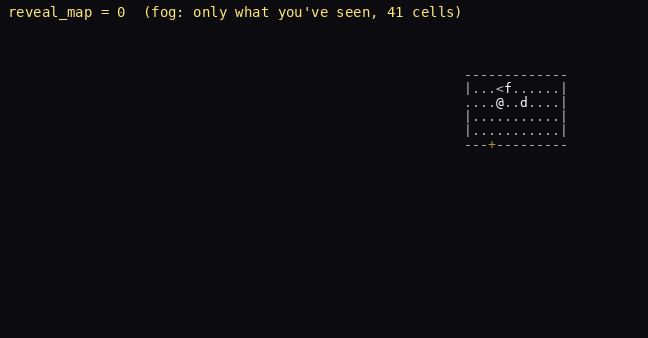
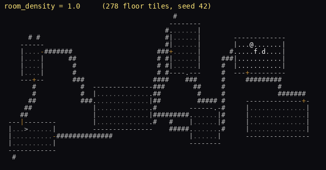
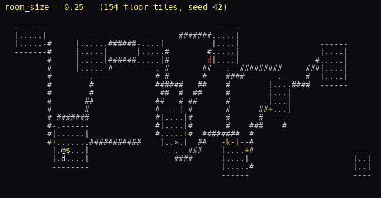
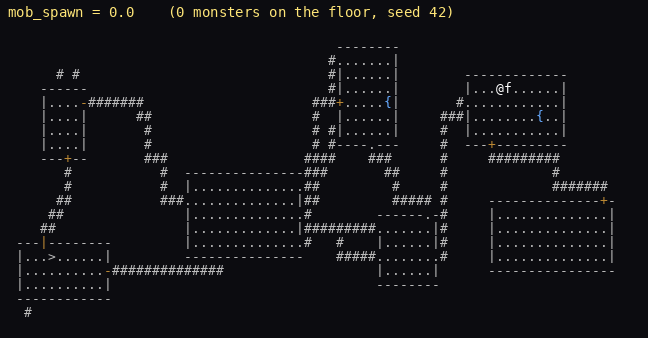
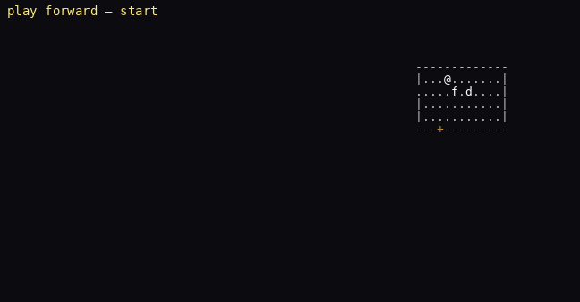
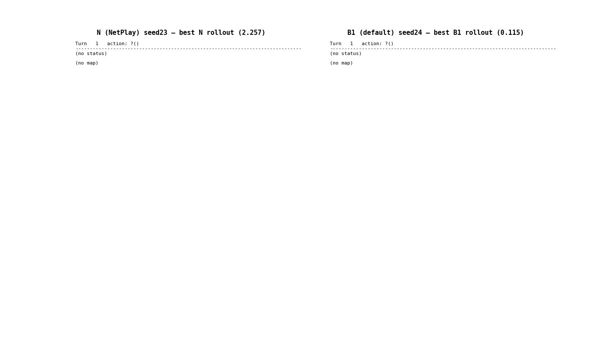
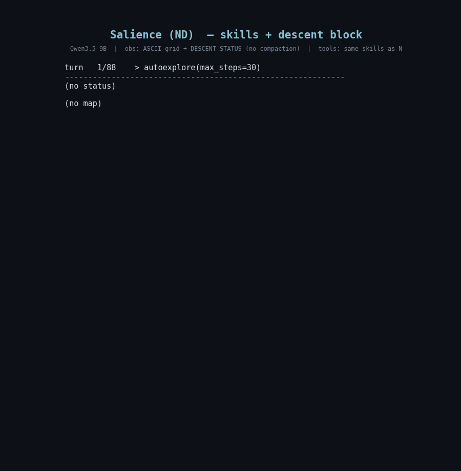

# nethack-rl

A training-grade RL + evaluation environment for NetHack, built on a **custom
NetHack fork** (the `third_party/NetHack` submodule) driven through a ctypes
binding — `nle` / `minihack` are no longer used. The fork turns NetHack into a
*controllable* substrate: in-memory snapshot/restore and branching, portable
level blobs, secure state edits, and 17 live difficulty/generation knobs. On top
of it sits an LLM-agent harness with a skill + code-mode interface, a 13-tier
curriculum, a dozen-plus observation encodings, replay capture, a web console,
and an in-browser rollout viewer.

**Mirrors:**
- Prime Hub: [`jonathanliu/nethack`](https://app.primeintellect.ai/dashboard/environments/jonathanliu/nethack) (v0.0.66+)
- GitHub: [`liujonathan24/NetHackHarness`](https://github.com/liujonathan24/NetHackHarness)

**Start here:** [`docs/CAPABILITIES.md`](docs/CAPABILITIES.md) (what the repo can
do) · [`docs/REPO_MAP.md`](docs/REPO_MAP.md) (where everything lives + one turn,
end to end) · [`docs/engine-layer.md`](docs/engine-layer.md) (the engine
reference) · [`docs/design.md`](docs/design.md) (design doc).

---

## What's new here (vs. prior NetHack RL)

Standard NetHack RL work runs on the `nle` gym wrapper (and `minihack` for level
authoring). That wrapper exposes a step/observation loop and nothing underneath
it. By driving a **custom fork through ctypes**, this project adds capabilities
that the gym wrapper structurally cannot:

- **In-memory snapshot / restore / branch.** Capture the entire game state —
  engine context, coroutine stack, arena, display mirror — in constant time and
  restore it byte-for-byte. `branch(n, reseed=True)` forks the *same* position
  into `n` divergent rollouts with no action replay. This is live Monte-Carlo
  lookahead, not a save-file reload. (`nle` has only TAS-style seed+action
  replay, which is O(steps).)
- **17 parametric difficulty / generation knobs.** Vision radius and fog,
  damage/HP/hunger/spawn/XP scales, and generation-time controls for room
  density, room size, mob spawn, traps, locked doors, and corridor connectivity —
  tunable live or at reset. `minihack` requires authoring a fixed `des` file per
  variant; here difficulty is a continuous dial on the real dungeon generator.
- **Portable level blobs.** `save_level` / `load_level` in NetHack's own
  `savelev`/`getlev` format — serialize and reload a concrete level, not a
  scripted description.
- **Secure, bounds-checked state edits.** `modify(hp=…, gold=…, goto_depth=…, …)`
  applies only whitelisted, range-validated mutations — useful for constructing
  exact eval scenarios without hand-playing into them.
- **One canonical map model behind every encoding.** ASCII, JSON, TOON, and the
  tile/tty image renders all read from a single typed model, so encodings cannot
  drift — which is what makes a clean *observation-encoding comparison* possible.
- **Dual agent interface.** A skill registry (one function-tool per skill) *and* a
  sandboxed `code(source=…)` mode over an `nh` namespace with a queryable map and
  sub-LM tools — beyond raw action indices.

Measured result: on matched seeds, a Qwen3-VL agent reaches **mean max dlvl
2.74 ± 0.41** (uncompressed ASCII + pet), clearing NetPlay's GPT-4 figure of 2.6;
the single biggest lever turned out to be **un**compressing the ASCII map. See
[`docs/netplay-parity-report.md`](docs/netplay-parity-report.md).

## Demos

**Difficulty & generation knobs** — the same seed, re-rolled across knob values
(rendered by `tools/knob_gifs.py`):

| Fog of war → full reveal | Room density |
|---|---|
|  |  |
| **Room size** | **Mob spawn** |
|  |  |

**Live snapshot / restore** — play forward, then step back through in-memory
snapshots (the same mechanism behind the web console's Undo and Checkpoint
buttons and `branch(n)`):



**What the model actually sees** — the rollout viewer / web console show the
exact LLM input per turn. Encodings compared side by side on one seed:

| NetPlay-style vs. B1 ASCII | Salience / dir8 variants |
|---|---|
|  |  |

## Web console

A Flask app (`tools/play_server.py`) over a shared engine, for live play and
demos:

```bash
PYTHONPATH="$PWD:$PWD/environments/nethack" python tools/play_server.py
# then open http://127.0.0.1:8080  (--host / --port to change)
```

This needs the engine built locally (`bash nethack_core/build_engine.sh`), which
requires a Linux/GNU toolchain. **On macOS** the engine does not build natively
(AppleClang/Mach-O vs the fork's GNU-toolchain arena interposition), so run the
console in Docker instead:

```bash
# build once (on Apple Silicon this is a NATIVE arm64 build — fast, no emulation;
# do NOT use --platform linux/amd64, which deadlocks NetHack's mid-build helpers
# under qemu). On Intel macOS drop the --platform flag.
docker build --platform linux/arm64 -f Dockerfile.console -t nethack-console .

# run; open http://localhost:8080
docker run --platform linux/arm64 --rm -it -p 8080:8080 nethack-console
```

`Dockerfile.console` builds `libnethack.so` from the submodule and adds Flask (the
console dep). Recordings written inside the container are ephemeral; add
`-v "$PWD/<dir>":/opt/nethack-console/<dir>` to persist them. If host port 8080 is
taken, map another, e.g. `-p 5050:8080`.

- **`/map`** — play NetHack in the browser; live difficulty-knob sliders, reset
  knobs for floor generation, snapshot-backed **Undo** (Backspace) and
  **Checkpoint / Restore** (the live Monte-Carlo demo: pin a position, roll
  forward, snap back, re-roll).
- **`/obs`** — build an observation in any encoding and plot metrics over a run.
- **`/traces`** — scrub a recorded rollout turn by turn, game state beside the
  exact LLM input.

## Rollout viewer

`tools.rollout_view.live_server` serves a localhost UI for browsing recorded
rollouts and stepping a fresh one live — two panes per turn: the **game state**
(the tty grid the human sees) and the exact **LLM input** (the chosen encoding).

```bash
# server binds 127.0.0.1:8765; runs-root is scanned for recorded rollouts
PYTHONPATH="$PWD:$PWD/environments/nethack" \
  python -m tools.rollout_view.live_server \
  --runs-root environments/nethack/outputs/evals --port 8765

# generate keyless demo traces first if you have no recorded runs:
PYTHONPATH="$PWD:$PWD/environments/nethack" \
  python -m tools.rollout_view.demo --variants B1 JSON IMG
```

It also serves **`/browse`** (a Finder-style click-through of the runs folder)
and **`/dashboard?path=<rel>`** (a stats dashboard: KPI strip, per-run outcome
table, and inline dlvl/HP/XP/kills time-series). The dashboard is also a CLI
(`python -m tools.rollout_view.dashboard …`); metrics are computed post-hoc over
saved traces and are extensible via `stats.register_metric(name, fn)`.

All eval/rollout output lives under `environments/nethack/outputs/` (gitignored);
point `prime eval --output-dir` at `environments/nethack/outputs/evals/<name>` so
runs persist and show up in the viewer.

## Architecture

A `uv` workspace whose layers separate the bare environment (for RL algorithms)
from the full harness (for chat-based LLM agents) over the same engine. See
[`docs/REPO_MAP.md`](docs/REPO_MAP.md) for the full map and the turn-by-turn data
flow.

- **`nethack_core/`** — interface-agnostic substrate. The ctypes binding
  (`_engine.py`), the deterministic `EngineEnv` (snapshot/restore/branch, level
  blobs, `modify()`, the 17-knob `tune` catalog), `NetHackCoreEnv` (gym wrapper,
  seed-before-reset), observation shaping, and the canonical typed map model.
- **`nethack_interface/`** — a typed, pysc2-style interface: `Observation` /
  `Action` / specs, with the action schema derived from the skill registry and a
  raw action-index escape hatch.
- **`environments/nethack/`** — the verifiers wrapper for the Prime Hub
  (`nethack.py: load_environment`) plus the `nethack_harness/` package (prompt
  variants, curriculum, skills, navigation, memory, refiner).
- **`approaches/`** — standalone agent strategies (go-explore, voyager, rlm,
  continuous-harness).
- **`tools/`** — the web console, knob-GIF renderer, rollout viewer + stats
  dashboard, and the encoding-comparison harness.

## Getting started

```bash
# system deps for the NetHack fork build (Debian/Ubuntu)
sudo apt install -y cmake bison flex libbz2-dev

# fetch the NetHack fork submodule + build libnethack.so
git submodule update --init --recursive
bash nethack_core/build_engine.sh   # -> third_party/NetHack/src/build/libnethack.so

# install the uv workspace. --all-packages is REQUIRED: numpy/gymnasium used to
# arrive transitively via nle; with nle/minihack removed they are direct
# workspace deps and a bare `uv sync` under-installs.
uv sync --extra dev --all-packages

# smoke test (no API keys)
pytest tests/ -q                # ~396 tests across 53 files

# smoke test the verifiers wrapper against the Hub-deployed env
# (needs OPENAI_API_KEY or PI_API_KEY)
vf-eval nethack -m gpt-4.1-mini -n 1 -r 1 \
  -a '{"tier": "corridor_explore"}' --endpoints configs/endpoints.toml

# or hosted (uses Prime Inference, billed to your account)
prime eval jonathanliu/nethack -m Qwen/Qwen3.5-9B -n 1 -r 1 \
  -a '{"tier": "corridor_explore", "max_turns": 30}'
```

**Key CLI gotcha**: pass env config via `-a` (env-args, goes to
`load_environment`), NOT `-x` (extra-env-kwargs). `interface="code"` via `-x` is
silently ignored because the tool list is baked at construction time. See
[`docs/EVAL_RECIPES.md`](docs/EVAL_RECIPES.md).

## Configuring a rollout

Everything below is a `load_environment` argument (pass as JSON via `-a`):

**Interface** — `interface`:
- `"skill"` (default): one OpenAI function-calling tool per skill.
- `"code"`: a single `code(source=...)` tool running sandboxed Python against an
  `nh` namespace exposing all skills + a queryable `nh.map` + sub-LM tools
  (`nh.summarize/plan/recall_lm`).

**Observation encoding** — `variant` (from the variant registry):

| variant | what the model sees |
|---|---|
| `B1` (default), `B0` | canonical ASCII map + status/inventory/adjacency (compacted / uncompressed) |
| `B` | BALROG natural-language scene (no ASCII grid) |
| `G` | glyph-box render (pair with `interface="code"`) |
| `JSON`, `TOON` | the canonical map model serialized as structured text (`map_detail` = full/minimal) |
| `IMG` | rendered NetHack tiles (image is the sole spatial channel) |
| `IMG_TTY` | tty-text raster image |
| `ND`, `FD` | descent-salience blocks |
| `E1`, `E2` | frontier-surface obs (text blocks / painted onto the map) |
| `R` | summarize-and-reset history compaction |
| `P`, `CH` | Continual-Harness self-refinement (`P`) / full continual harness (`CH`) |

**Skill set** — `skill_set`: `"full"` (default), `"move"`, `"dir8"`,
`"netplay"` (Jeurissen CoG 2024 profile), or a comma-separated allowlist.

**Curriculum** — `tier` (13 tiers): `empty_room`, `solo_combat`, `multi_combat`,
`corridor_explore` (default), `mini_dungeon`, `mines_to_minetown`,
`sokoban_complete`, `oracle_consult`, `full_dungeon_easy`, `full_nle`,
`dynamic_subgoal`, `quest_complete`, `castle_reached`. Pass `tier=None` to sample
uniformly.

**Memory / history** — `history_keep_full`, `history_drop_after`,
`belief_state_interval`, `journal_render_max_chars`, `continual` +
`continual_lives` (auto-reset on death, preserving journal/belief state).

**Capture** — `trace_dir`: write per-turn NDJSON (raw grid, structured obs,
rendered message, tool calls, action, reward, dlvl, hp) for the rollout viewer.

Rewards are always `scout_reward` + `descent_reward` + `success_reward` +
`ascension_reward` (a `vf.Rubric`).

## Publishing to the Prime Intellect Environments Hub

```bash
uv tool install prime
prime login
python tools/bundle_for_hub.py    # vendor nethack_core into the env package
cd environments/nethack
prime env push --visibility=PRIVATE --auto-bump
```

`bundle_for_hub.py` is critical — the Hub installs only `environments/nethack/`
as a tarball, so the workspace dep `nethack-core` is unresolvable there. The
script copies the substrate into `environments/nethack/nethack_core/` so the built
wheel is self-contained.

## Branch layout

- **`main`** — the clean public tree: engine + harness code, the demo GIFs, and
  curated docs (`docs/`).
- **[`experimental`](https://github.com/liujonathan24/NetHackHarness/tree/experimental)**
  — everything on `main` plus the internal process artifacts: the OpenSpec
  capability specs and change history (`openspec/`), per-fix onboarding
  walkthroughs (`docs/onboarding/`), the regression experiment suite
  (`experiments/`), the launchpad TUI (`tools/launchpad/`), and scratch logs.
  This is the working branch for ongoing development.

## Project status

**Env v0.0.66+ on the Hub.** Default tier `corridor_explore` (reach dlvl 2),
default variant `B1`. ~396 tests green. Active research axis: observation-encoding
comparison across ASCII / IMG / IMG_TTY / JSON / TOON, and continual-harness
self-refinement.

*Author: Jonathan Liu.*
