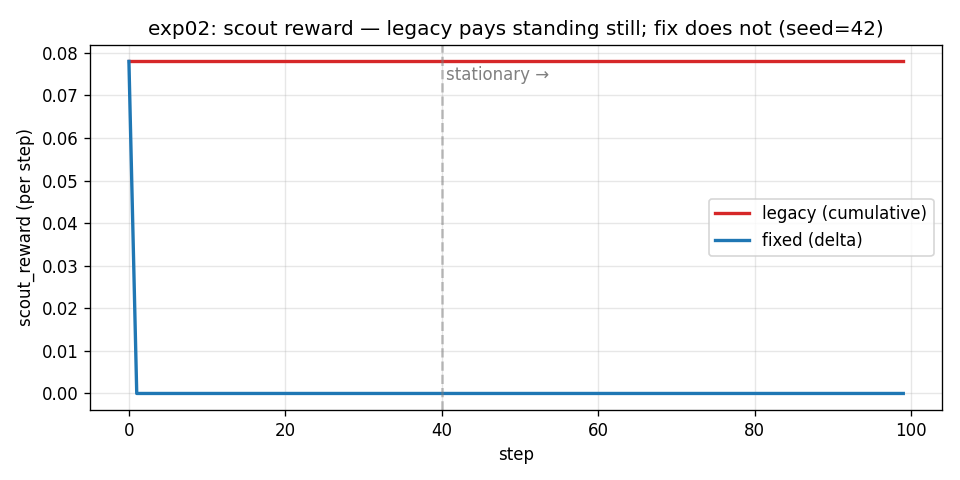
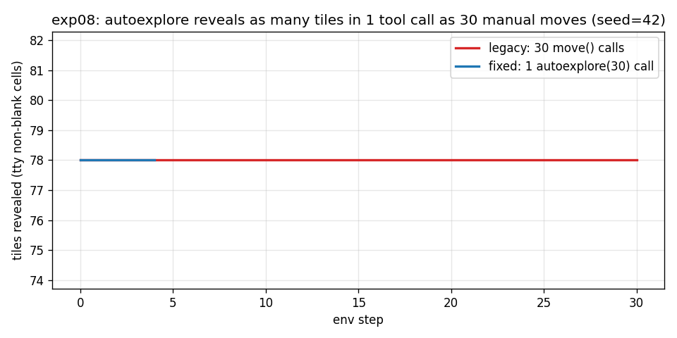
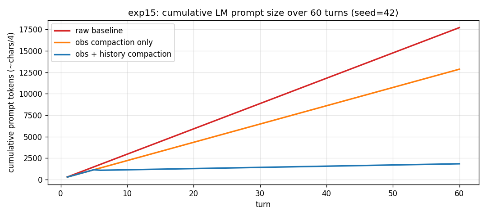

# Experiment Report

Auto-generated by `experiments/build_report.py` from `experiments/results/`.
Run with `python experiments/run_all.py` to refresh JSONs.

## Summary table

| | experiment | verdict | headline |
|-|-----------|---------|---------|
| 📊 | `baseline_agents_corridor_explore` | BASELINE | reward by baseline: random_walk=1.067, always_search=-0.5, autoexplore=-0.003 |
| ✅ | `exp01_seeding` | FIX CONFIRMED | two reruns hash to `aa37987c63c6968e` (was: legacy raised `RuntimeError: Should not try changing seeds`) |
| ✅ | `exp02_scout_reward` | FIX CONFIRMED | stationary mean: legacy=0.0780/step, fixed=0.0000/step |
| ✅ | `exp03_menu_masking` | FIX CONFIRMED | max row width: legacy=57, fixed=12 (menu at col 38) |
| ✅ | `exp04_bootstrap` | FIX CONFIRMED | 5/5 seeds parsed role; legacy 0/5 |
| ✅ | `exp05_terminal_detection` | FIX CONFIRMED | ascension reward: legacy=0.0 always, fixed=1.0 on win |
| ✅ | `exp08_autoexplore` | FIX CONFIRMED | 4.0x more env actions per LM tool-call (4.0 vs 1.0) |
| ✅ | `exp13_code_mode` | FIX CONFIRMED | 1 tool call replaces 4 (3 round-trips saved) |
| ✅ | `exp14_subgoal_achievement` | SHIPS | 0% subgoal achievement on 5 seeds (autoexplore baseline) |
| ✅ | `exp15_token_savings` | SHIPS | 25.7% per-turn obs reduction; 89.8% cumulative reduction at turn 60 |

## Per-experiment detail

### 📊 baseline_agents_corridor_explore  —  BASELINE

**reward by baseline: random_walk=1.067, always_search=-0.5, autoexplore=-0.003**

Raw JSON: `experiments/results/baseline_agents_corridor_explore.json`

### ✅ exp01_seeding  —  FIX CONFIRMED

**two reruns hash to `aa37987c63c6968e` (was: legacy raised `RuntimeError: Should not try changing seeds`)**

Raw JSON: `experiments/results/exp01_seeding.json`

### ✅ exp02_scout_reward  —  FIX CONFIRMED

**stationary mean: legacy=0.0780/step, fixed=0.0000/step**

Raw JSON: `experiments/results/exp02_scout_reward.json`

### ✅ exp03_menu_masking  —  FIX CONFIRMED

**max row width: legacy=57, fixed=12 (menu at col 38)**

Raw JSON: `experiments/results/exp03_menu_masking.json`

### ✅ exp04_bootstrap  —  FIX CONFIRMED

**5/5 seeds parsed role; legacy 0/5**

Raw JSON: `experiments/results/exp04_bootstrap.json`

### ✅ exp05_terminal_detection  —  FIX CONFIRMED

**ascension reward: legacy=0.0 always, fixed=1.0 on win**

Raw JSON: `experiments/results/exp05_terminal_detection.json`

### ✅ exp08_autoexplore  —  FIX CONFIRMED

**4.0x more env actions per LM tool-call (4.0 vs 1.0)**

Raw JSON: `experiments/results/exp08_autoexplore.json`

### ✅ exp13_code_mode  —  FIX CONFIRMED

**1 tool call replaces 4 (3 round-trips saved)**

Raw JSON: `experiments/results/exp13_code_mode.json`

### ✅ exp14_subgoal_achievement  —  SHIPS

**0% subgoal achievement on 5 seeds (autoexplore baseline)**

Raw JSON: `experiments/results/exp14_subgoal_achievement.json`

### ✅ exp15_token_savings  —  SHIPS

**25.7% per-turn obs reduction; 89.8% cumulative reduction at turn 60**

Raw JSON: `experiments/results/exp15_token_savings.json`
