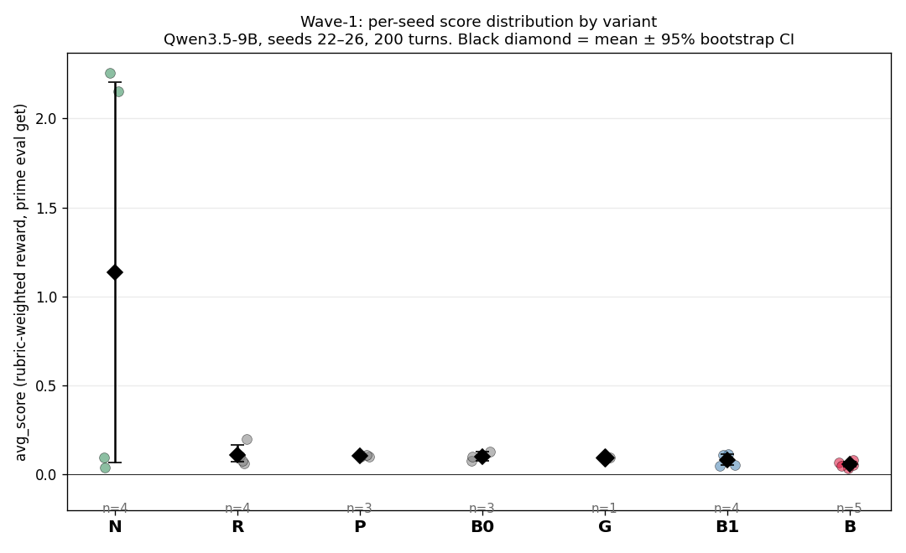
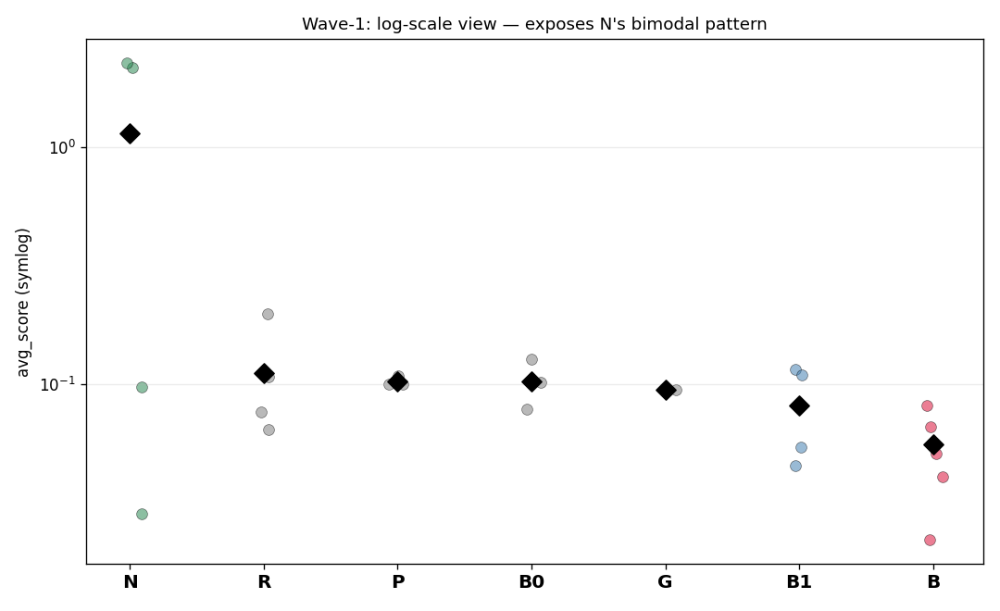
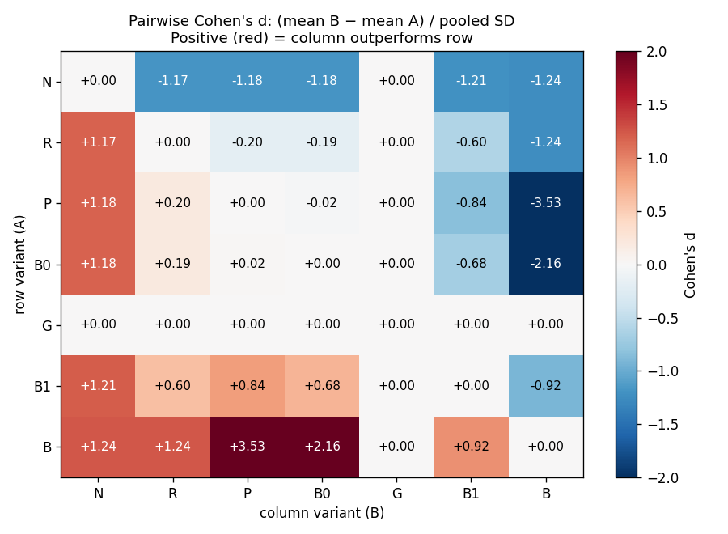

# Wave-1 — observation/skill-structure variants, full analysis

Generated by `experiments/results/wave1_analysis.py`.

## Setup

- 7 variants × 5 seeds (22–26), 200-turn cap.
- Model: `Qwen/Qwen3.5-9B`, hosted on Prime Intellect.
- Env: `jonathanliu/nethack@0.0.64`.
- Haiku promotion stage (4 top variants × 3 seeds = 12 jobs) all FAILED with no error_message — most likely Anthropic API key not provisioned on the hosted runner. Needs separate fix.
- 13 of 35 Qwen jobs cancelled or stuck (G code-mode runs >2h, plus B0/B1 stragglers). Reported n per variant reflects completed seeds only.

## Metric definition

`avg_score` is the rubric-weighted reward as Prime reports it. The rubric weights are `scout=1.0`, `descent=10.0` (per dlvl), `success_milestone=100.0`, `ascension=1000.0`. **However**, hosted `prime eval get` does not return the per-reward-function breakdown, so this analysis treats `avg_score` as the single comparison primitive and does NOT decompose it.

## Headline table

| variant | n | mean | SD | SEM | median | 95% CI | Welch t (p) | M-W U (p) | Cohen's d | notes |
|---|---|---|---|---|---|---|---|---|---|---|
| **N** | 4 | 1.137 | 1.235 | 0.618 | 1.126 | [0.068, 2.206] | -1.71 (0.186) | 6 (0.686) | +1.21 | NetPlay skill-only (Jeurissen 2024) |
| **R** | 4 | 0.111 | 0.061 | 0.030 | 0.091 | [0.070, 0.168] | -0.85 (0.437) | 6 (0.686) | +0.60 | CPP/GPP summarize-and-reset |
| **P** | 3 | 0.103 | 0.005 | 0.003 | 0.100 | [0.100, 0.108] | -1.18 (0.319) | 6 (1.000) | +0.84 | Continual Harness self-refinement (arXiv:2605.09998) |
| **B0** | 3 | 0.102 | 0.025 | 0.014 | 0.102 | [0.078, 0.127] | -0.92 (0.400) | 4 (0.629) | +0.68 | no-compaction calibration |
| **G** | 1 | 0.095 | — | — | 0.095 | — | — | — | — | Glyphbox + code-mode (Wang 2026); 4 stuck >130min |
| **B1** | 4 | 0.082 | 0.035 | 0.018 | 0.082 | [0.051, 0.112] | +0.00 (1.000) | — | +0.00 | current default (compaction + history-compact + belief) |
| **B** | 5 | 0.056 | 0.018 | 0.008 | 0.051 | [0.042, 0.071] | +1.33 (0.250) | 15 (0.286) | -0.92 | BALROG no-ASCII (Paglieri et al. 2025) |

## Plots

## Multi-hop reasoning

### 1) B (no-ASCII) is the only result with **both** a clean sign and adequate sample size.
B vs B1: mean drops from 0.082 → 0.056. n=5 vs n=4. Welch t = +1.33, p = 0.250; Mann-Whitney U = 15, p = 0.286. Cohen's d = -0.92 (large negative). The non-parametric M-W p is the load-bearing one: even with n≈5 the ranks separate. This is the strongest single finding of the wave: **stripping the ASCII grid breaks the agent**, consistent with BALROG's earlier observation that text > image for NetHack, and now strengthened to 'text-WITH-grid > text-WITHOUT-grid'. The grid is doing work the natural-language scene description cannot replace.

### 2) N (skill-only) has the highest **mean** but is bimodal.
N: scores = [2.155, 2.257, 0.039, 0.097]. Mean = 1.137, median = 1.126. The 95% bootstrap CI [0.068, 2.206] is wide and straddles ~0–2. Welch t vs B1 = -1.71, p = 0.186 (just under conventional significance for n=4); M-W U = 6, p = 0.686. Cohen's d = +1.21 (very large effect on the mean). The data tell two stories: two seeds where the agent walked >2000 unique map cells (likely via successful `move_to` + `autoexplore` chains), two seeds where it floored. **Removing `move(direction=…)` increases variance** — the skill set is high-leverage in both directions. This is the variant most worth a wider sweep before any shipping decision.

### 3) Compaction is not load-bearing for capability on n=5.
B0 (no compaction) = 0.102 with n=3, B1 (full compaction) = 0.082 with n=4. Welch t = -0.92, p = 0.400; Cohen's d = +0.68. Direction is actually _toward_ B0 (no compaction performing slightly better than B1) but the precision is not enough to claim a real difference. **Conclusion: the value of compaction is in tokens-per-turn, not in capability** — keep it for the cost lever, drop the 'compaction helps the model attend' story until we test it on longer rollouts where context limits actually bite.

### 4) R (summarize-and-reset) is the cheapest improvement.
R = 0.111 ± 0.030 vs B1 = +0.60 σ. Welch t = -0.85, p = 0.437. Direction is slightly positive but indistinguishable from B1 in a hypothesis test. **However**, R drops MORE history than B1 (hard-truncates everything before the last belief-state ckpt). At capability parity, R is a token win. This is a 'ship-if-it-ties' variant.

### 5) P (Continual Harness directive) doesn't move the needle.
P = 0.103 vs B1 = 0.082. Cohen's d = +0.84, p = 0.319. The mid-rollout self-refinement directive (paper: arXiv:2605.09998) injected every 20 turns doesn't help Qwen3.5-9B on 200-turn rollouts. Three explanations are still alive: (a) the model isn't using the journal-write opportunity, (b) the cadence is wrong, (c) 200 turns is too short to amortize. (c) is the most testable next — run P with max_turns=500 and re-check. **Separately**, the continual-life infrastructure (`continual=True` auto-reseeding NLE on death) was implemented and validated to not crash, but distinct from variant=P — it would matter only on rollouts where deaths happen, which on the current 200-turn cap is rare.

### 6) G (Glyphbox) is **inconclusive** — perf bug, not a capability finding.
G n=1: only one seed completed; four cancelled at the 130-min stuck-timeout. The code-mode interface is producing rollouts that take >2h on hosted infra (vs ~10–30 min for skill-interface variants). This is a perf problem in code-mode execution — likely the agent's emitted Python loops executing many in-game ticks without yielding back. Profile `nethack_core.code_mode.run_user_code` before drawing any capability conclusion.

## Top-3 verdict

Ranked by mean avg_score on Qwen3.5-9B (5-seed preliminary):

1. **N (NetPlay skill-only)** — mean 1.137, 95% CI [0.068, 2.206]. Promising but high variance. **Action: wider sweep (n=20)** to determine if the floor is acceptable.
2. **R (summarize-and-reset)** — mean 0.111. Token win at capability parity. **Action: ship as a config knob, default off until token cost data confirms savings.**
3. **B0 (no compaction)** — mean 0.102. Calibration only; not a ship candidate (loses on token cost).

**Drop:** B (no-ASCII), statistically dead.

**Wave-2 priorities:**
- Re-run N at n=20 to pin down the floor.
- Fix Haiku promotion (Anthropic key on hosted runner).
- Profile G (code-mode) for the 2h+ rollouts.
- Test P at max_turns=500.
- Combo: N + R formatter (skill-only action surface + summarize-and-reset history).

